<!-- GFM-TOC -->
# 深入理解java虚拟机：JVM高级特性与最佳实践
[传送门](https://read.douban.com/ebook/15233695/)

---
* [第一部分 走进java]()
* [第二部分 自动内存管理机制]()
   * [第二章 java内存区域与内存溢出异常]()
   * [第三章 垃圾收集器与内存分配策略]()
   * [第四章 虚拟机性能与故障处理工具]()
   * [第五章 调优案例分析与实战]()
* [第三部分 虚拟机执行子系统]()
   * [第六章 类文件结构]()
   * [第七章 虚拟机类加载机制]()
   * [第八章 虚拟机字节码执行引擎]()
   * [第九章 类加载及执行子系统的案例与实战]()
* [第四部分 程序编译及代码优化]()
   * [第十章 早期（编译器）优化]()
   * [第十一章 晚期（运行期）优化]()
* [第五部分 高效并发]()
   * [第十二章 java内存模型与线程]()
   * [第十三章 线程安全与锁优化]()

---
## 第一部分 走进java
## 第二部分 自动内存管理机制
### 第二章 java内存区域与内存溢出异常
#### java虚拟机运行时内存布局  
   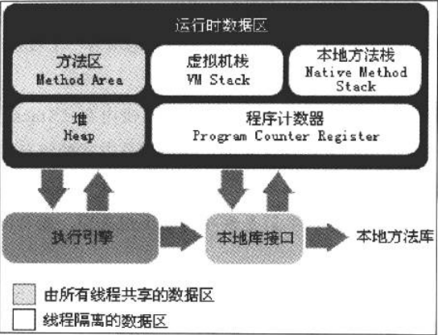

* 程序计数器与java虚拟机栈都是线程私有的，对于native方法，pc值为空（Undefined）
* 虚拟机栈和本地方法栈都会抛出StackOverflowError和OutOfMemoryError
* Java堆是线程共享的。分为新生代与老年代，例如Eden空间，From Survivor， To Survivor；概念*TLAB*（Thread Local Allocation Buffer，线程私有的分配缓冲区）
    > The heap is the runtime data area from which memory for all class instances and arrays is allocated

* 方法区（Method Area，或者Non-heap）线程共享，对于HotSpot，也称为*永久代*（Permanent Generation）而永久代将来可能被Native Memory替代，JDK1.7之后，字符串常量池已从永久代移出；方法区无法分配内存时，抛出OutOfMemoryError
    > 在 JDK 1.8 中用元空间替换了永久代作为方法区的实现，元空间是本地内存

* 运行时常量池（Runtime Constant Pool），属于方法区
    > String.intern()：Native方法，如果字符串常量池中已经包含一个等于String对象的字符串，则返回代表池中这个字符串的String对象；否则，将此String对象包含的字符串添加到常量池中，并返回此String对象的引用。
* 直接内存（Direct Memory）
#### 对象的内存布局（HotSpot）
   * 对象头（header）、示例数据（Instance Data）、对齐填充（Padding）
   * 对象头分为两部分：Mark Word（存储对象自身运行时数据）、类型指针  
   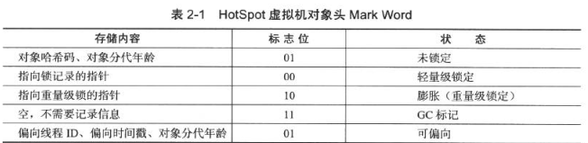
#### 对象的访问定位
   * 句柄  
   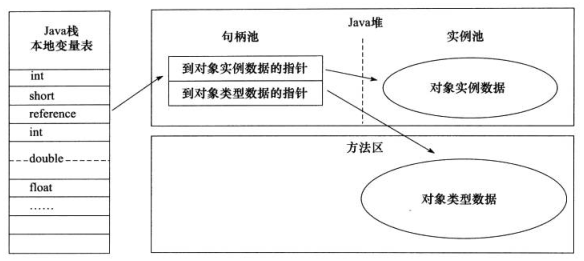  
   * 直接指针（HotSpot）  
   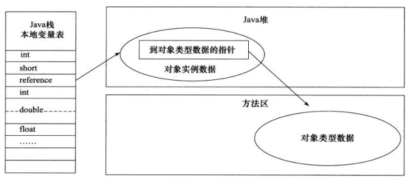

### 第三章 垃圾收集器与内存分配策略
#### 如何判定对象已“死”
   * 引用计数法（Reference Counting）
   * 可达性分析算法（Reachability Analysis），GC Root和引用链（Reference Chain）  
       * `GC Root：栈帧中局部变量表中引用的对象、方法区中类静态属性引用的对象、方法区中常量引用的对象、本地方法栈中JNI引用的对象`
   * jdk1.2以后的四种引用类型
      * 强引用（Strong Reference）：`Object obj = new Object()`
      * 软引用（Soft Reference）：弱引用对象在将要发生内存溢出异常时会被加入到回收范围进行第二次回收
      * 弱引用（Weak Reference）：被弱引用关联的对象只能生存到下一个GC发生之前
      * 虚引用（Phantom Reference）：为一个对象设置虚引用能在该对象被GC时受到系统通知
   * finalize()方法：对于覆写了finalize()方法且该方法未被虚拟机调用过的对象，虚拟机会将其加入F-Queue中，之后一个由虚拟机自动建立的低优先级Finalizer线程执行。*在finalize()方法中重新关联上引用链以实现对象的自我拯救*
   * 方法区的回收
#### 垃圾收集算法
   * 标记清除算法（Mark-Sweep）：效率低、内存碎片
   * 复制算法（Coping）
   * 标记整理算法（Mark-Compact）
   * 分代收集算法（Generational Collection）
#### HotSpot的GC算法
   * 枚举根节点
      * GC停顿（*Stop The World*）
      * 准确式GC
   * 安全点（Safepoint）
      * 抢先式中断（Preemptive Suspension）
      * 主动式中断（Voluntary Suspension）：轮询标志，例如 `test %eax, 0x160100`
   * 安全区域（Safe Region）
#### HotSpot垃圾收集器
   * Serial：单线程
   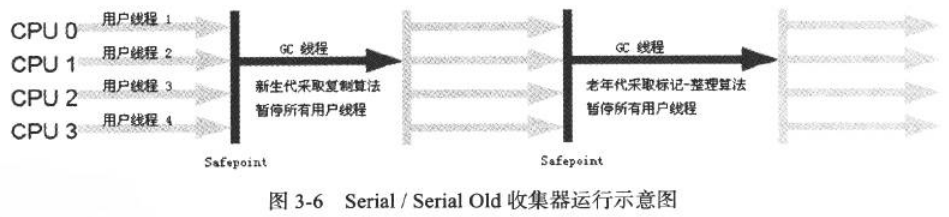
   * ParNew：Serial的多线程版本
   
   * Parallel Scavenge：可控制的吞吐量（Throughput）或“吞吐量优先”，多线程+复制算法
   * Serial Old：Serial老年代版本，可配合Parallel Scavenge或CMS
   * Parallel Old：Parallel Scavenge老年代版本，多线程+标记整理算法
   
   * CMS（Concurrent Mark Sweep）
      * CPU资源敏感
      * 浮动垃圾（Floating Garbage）导致Concurrent Mode Failure并导致Full GC
      * 内存碎片
   
   * G1（Garbage First）
      * 并行与并发
      * 分代收集
      * 空间整合：整体基于标记整理算法，Region之间使用复制算法
      * 可预测的停顿
   

#### 对象分配与回收策略
   * 对象优先在Eden分配
   * 大对象直接进入老年代
   * 长期存活对象进入老年代（age）：-XX:MaxTenuringThreshold
   * 动态对象年龄判定
   * 空间分配担保（Handle Promotion）：-XX:HandlePromotionFailure参数

#### Full GC的触发
   * System.gc()，只是**建议**
   * 老年代空间不足
   * 空间分配担保失败
   * JDK1.7及以前的永久代空间不足
   * Concurrent Mode Failure

### 第四章 虚拟机性能监控与故障处理工具
   * jps：虚拟机进程状况
   * jstat：虚拟机统计信息见识
   * jinfo：Java配置信息
   * jmap：Java内存映像
   * jhat：虚拟机堆转储快照分析
   * jstack：Java堆栈追踪
   * HSDIS（HotSpot Disassembler）：JIT生成反汇编，-XX:+PrintAssembly
   * 可视化工具
      * JConsole
      * VisualVM

### 第五章 调优案例分析与实战

## 第三部分 虚拟机执行子系统
### 第六章 类文件结构
* class文件结构（**Big-endian**）  
   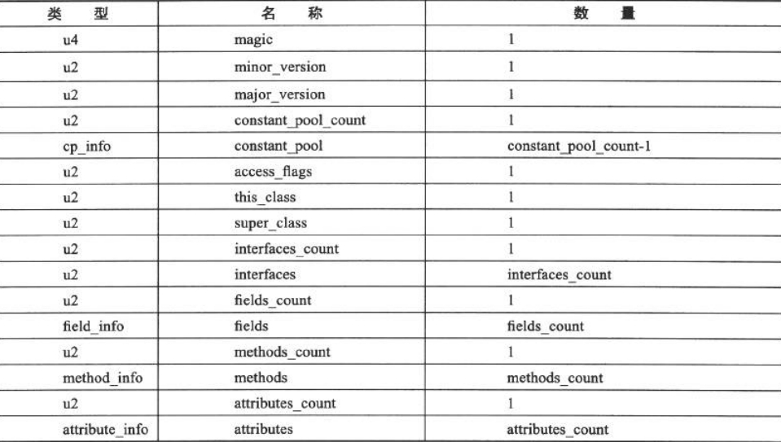
* 魔数（Magic Number）0xCAFEBABE
* 常量池
   * *字面量*（Literal）
   * *符号引用*（Symbolic Reference）
      * 类和接口的全限定名（Fully Qualified Name）
      * 字段名称和描述符
      * 方法名称和描述符
   * 常量项结构  
    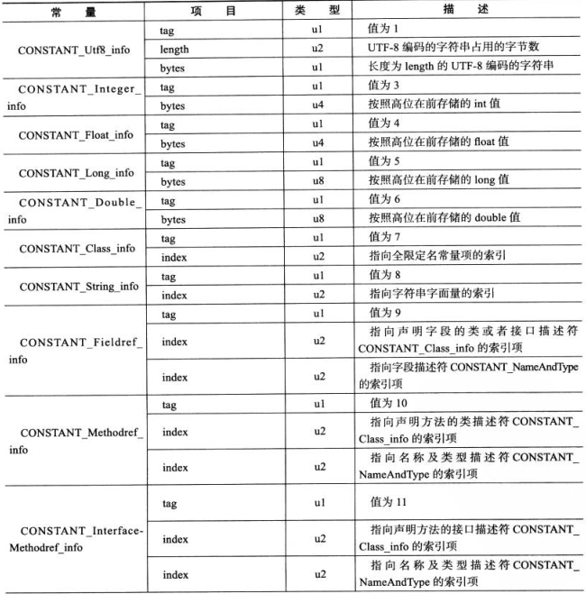
    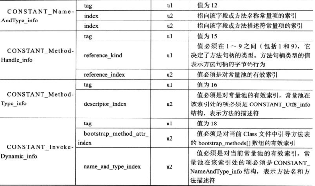
* 访问标志（Access flags）
* 类索引，父类索引，接口索引集合
* 字段表（field-info）集合：类变量和实例变量
* 方法表集合
* 属性表（attribute-info）集合，在JDK1.7中预定义21项
   * Code属性
      * Slot是虚拟机为局部变量分配内存的最小单位，Slot可以重用，局部变量表的第一个Slot存放对象实例的引用
      * code_length：u4，一个方法不允许超过65535条字节码指令（u2）
      * 编译器使用异常表来实现异常及finally处理机制，编译器在每段可能的分支路径之后都将finally语句块的内容冗余一遍来实现finally语义
   * Exceptions属性：列举受查异常（Checked Exceptions）
   * LineNumberTable属性：java源码行号与字节码行号对用关系，-g:none后-g:lines取消
   * LocalVariableTable属性：栈帧中局部变量表的变量与java源码定义的变量对应关系，便于调试，-g:none或-g:vars取消
   * SourceFile属性
   * ConstantValue属性：通知虚拟机自动为类静态变量赋值（static，ACC_STATIC）
		> 对于Sun javac：`static final 基本类型/java.lang.String` 会生成ConstantValue属性 
    
   * InnerClasses属性
   * Deprecated（@Deprecated注解）
   * Synthetic：所有由非用户代码产生的类，方法和字段都应设置Synthetic属性和ACC_SYNTHETIC
      * 例外：`<init>`和`<clinit>`
   * StatckMapTable属性：变长属性，位于Code属性中（一个Code属性至多一个），被Type Checker使用
      * 栈映射帧（Stack Map Frames）
   * Signature属性
   * BootstrapMethods属性
* 字节码指令

### 第七章 虚拟机类加载机制
#### 类加载的时机
   * 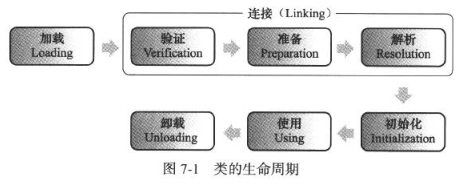
   * 解析阶段在某些情况下可在初始化阶段之后开始
   * 类的初始化
      * 主动引用（有且仅有**5**种）
         * 遇到 new、getstatic、putstatic、invokestatic 这四条字节码指令时，如果类没有进行过初始化，则必须先触发其初始化。最常见的生成这 4 条指令的场景是：使用 new 关键字实例化对象的时候；读取或设置一个类的静态字段（被 final 修饰、已在编译器把结果放入常量池的静态字段除外）的时候；以及调用一个类的静态方法的时候
         * 使用 java.lang.reflect 包的方法对类进行反射调用的时候，如果类没有进行初始化，则需要先触发其初始化
         * 当初始化一个类的时候，如果发现其父类还没有进行过初始化，则需要先触发其父类的初始化。
         * 当虚拟机启动时，用户需要指定一个要执行的主类（包含 main() 方法的那个类），虚拟机会先初始化这个主类
         * 当使用 jdk1.7 的动态语言支持时，如果一个 java.lang.invoke.MethodHandle 实例最后的解析结果为 REF_getStatic, REF_putStatic, REF_invokeStatic 的方法句柄，并且这个方法句柄所对应的类没有进行过初始化，则需要先触发其初始化

      * 被动引用（不会触发类的初始化）
         * 通过子类引用父类的静态字段，不会导致子类初始化
         * 通过数组定义来引用类，不会触发此类的初始化
         * 常量在编译时期会存入调用类的常量池中，不会触发定义常量的类的初始化
         * ...
   * 接口的初始化
      > 当一个类初始化时，要求其父类全部初始化，而接口初始化时，只有在真正使用到父接口的时候（如引用接口中定义的常量）才会触发父接口的初始化。

#### 类加载过程
   * 加载  
      * **注意：数组类本身不通过类加载器创建，而是由JVM直接创建**
   * 验证
      * 文件格式验证
      * 元数据验证
      * 字节码验证（数据流和控制流分析）
      * 符号引用验证
   * 准备：为类变量分配内存并设置类变量初始值，通常情况下是数据类型的*零值*, 对于`public static int value = 123;`，其初始值为0；而对`public static final int value = 123;`，JVM会根据ConstantValue设置其初始值为123
   * 解析：JVM将常量池内的符号引用替换为直接引用
      * 对于invokedynamic指令情况：动态调用点限定符（Dynamic Call Site Specifier）
   * 初始化
      * `<clinit>`内部语句顺序是static语句或static{}块在源文件中出现的顺序，**静态语句块只能访问到定义在它之前的类变量，定义在它之后的类变量只能赋值，不能访问**
      * JVM保证父类`<clinint>`一定在子类`<clinit>`之前执行，对于接口则不这样
      * 接口的实现类初始化时不会执行接口的`<clinit>`方法
      * 同一个类加载器下，一个类型智慧初始化一次
   * 类加载器
      * 每一个类加载器都拥有一个独立的类名称空间，所以**比较两个Class对象是否相等只有在同一个类加载器加载的情况下才有意义**  、

			public class Test {
    			static {
        			i = 0;                // 给变量赋值可以正常编译通过
        			System.out.print(i);  // 这句编译器会提示“非法向前引用”
    			}
    			static int i = 1;
			}
      * 系统提供的类加载器
         * 启动类加载器（Bootstrap ClassLoader）：使用C++实现，加载$JAVA_HOME/lib
         * 扩展类加载器（Extension ClassLoader）：sun.misc.Launcher$ExtClassLoader，$JAVA_HOME/lib/ext或java.ext.dirs
         * 应用程序类加载器（Application ClassLoader）：sun.misc.Launcher$AppClassLoader
      * 双亲委派模型（Parents Delegation Model）
         * 使用组合复用父加载器代码
         * 当父加载器无法加载时，子加载器才会尝试加载
      * *双亲委派模型的破坏

### 第八章 虚拟机字节码执行引擎
#### 运行时栈帧结构
   * 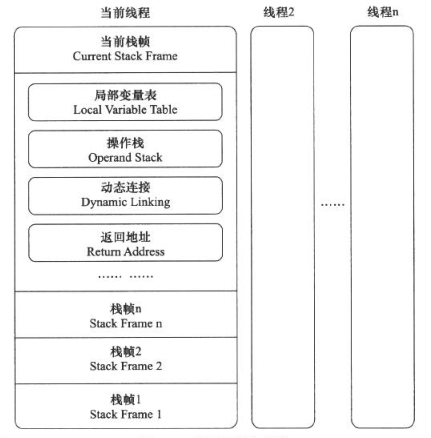
   * 局部变量表
      * Slot复用对GC的影响`不使用的对象应手动赋值为null`
   * 操作数栈（Operand Stack）
   * 方法返回地址
      * 正常完成出口（Normal Method Invocation Completion）
      * 异常完成出口（Abrupt Method Invocation Completion）
#### 方法调用
   * 解析（Resolution）：编译期确定，使用invokestatic和invokespecial调用的方法
   * 分派
      * 静态分派（Method **Overload** Resolution）：编译期确定，依赖静态类型来定位方法执行版本
         * 静态类型（Static Type）或外观类型（Apparent Type）
         * 实际类型（Actual type）
      * 动态分派：**Override**，在运行期根据实际类型确定方法执行版本
      * 单分派与多分派：方法的接受者和方法的参数统称为方法的**宗量**
      * JVM动态分派的实现
         * **虚方法表**（vtable）与接口方法表（itable）
         * 方法表在类加载器的连接阶段初始化
         * 其他：内联缓存（Inline Cache）、基于类型继承关系分析（Class Hierarchy Analysis，CHA）技术的守护内联（Guarded Inlining）
   * 动态类型语言支持
      * java.lang.invoke包：MethodType，MethodHandle，MethodHandles.lookup()、、、
      * INDY工具
#### 基于栈的字节码解释执行引擎

### 第九章 类加载及执行子系统的案例分析与实战
   * Tomcat
   * OSGi（Open Service Gateway Initiative）
   * 字节码生成技术与动态代理

## 第五部分 高效并发
### 第十二章 Java内存模型与线程
#### Java内存模型
   * 主内存与工作内存（Working Memory）
   * Java保证的8中原子操作：lock、unlock、read、load、use、assign、store、write
      * read和load顺序执行，store和write顺序
   * volatile的特殊规则
      * 此变量对所有线程的可见性，volatile变量在各个线程工作内存中不存在一致性问题，但是其运算在并发下并不安全
         * 在不符合一下两条规则的运算场景下，需要加锁
            * 运算结果不依赖变量的当前值，或者能确保只有一个线程修改变量的值
            * 变量不需要与其他变量共同参与不变约束
      * 禁止指令重排序（Instruction Reorder）优化
         > 线程内表现为串行的语义（Within-Thread As-If-Serial Semantics）

      * 内存屏障（Menory Barrier或Memory Fence）：指重排序时不能把后面的指令重排序到内存屏障之前的位置，例 `lock addl $0x0, (%esp)`，该lock指令是本CPU的Cache写入内存，该写入动作也会引起别的CPU或内核无效化其Cache
   * long和double型变量的非原子性协定（Nonatomic Treatment of double and long Variables），但目前商用虚拟机均选择将64位数据的读写操作作为原子操作对待
   * java中实现可见性的三个关键字
      * volatile
      * synchronized
      * final：被fina修饰的字段在构造器中一旦初始化完成，并且构造器没有把this的引用传递出去（this引用逃逸），那么其他线程就能看到final字段的值
   * 先行发生原则（happens-before）
      > 先行发生时java内存模型中定义的两项动作之间的偏序关系，如果操作A线程发生于与操作B，就是说再去爱发生操作B之前，操作A产生的影响能被操作B观察到，“影响包括修改了内存中共享变量的值、发送了消息、调用了方法等。

       	i = 1; // 在线程A中执行
       	j = i; // 在线程B中执行
       	i = 2; // 在线程C中执行
   * java内存模型的天然的先行发生关系
      * 程序次序规则（Program Order Rule）：**控制流顺序而非程序代码顺序**
      * 管程锁定规则（Monitor Lock Rule）：一个unlock操作先行发生于后面对同一个锁的lock操作，时间上的先后顺序
      * volatile变量规则
      * 线程启动规则
      * 线程终止规则
      * 线程中断规则
      * 对象终结规则（Finalizer Rule）：一个对象初始化完成现行发生于它的finalize()方法的开始
      * 传递性（Transitivity）
   * java与线程
      * 线程的实现
         * 内核线程（Kernel-Level Thread，KLT）与轻量级进程（Light Weight Process，LWP）  
            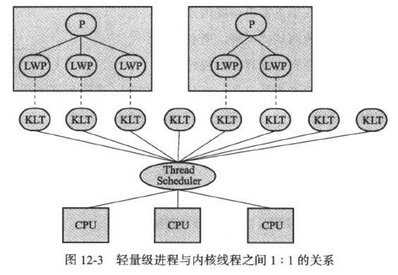
         * 用户线程（User Thread，UT)  
            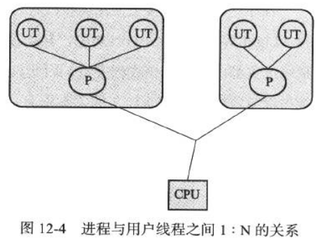
         * 用户线程加轻量级进程混合实现
            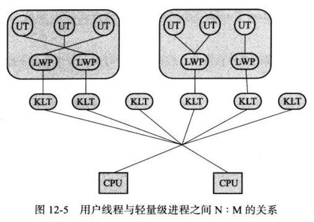
      * java线程的实现
         * 对于Windows和Linux，使用一对一的线程模型，一条java线程映射到一条LWP上
         * 对于Solaris，支持一对一和多对多
   * java线程调度
      * 目前java使用的是抢占式线程调度（Preemptive Threads-Scheduling），但是后续版本可能会提供协程（Coroutine）方式
      * java设置了10个线程优先级，Thread.MIN_PRIORUTY~Thread.MAX_PRIORITY
      * *Windows下的优先级推进器（Priority Boosting）

## 第十三章 线程安全与锁优化